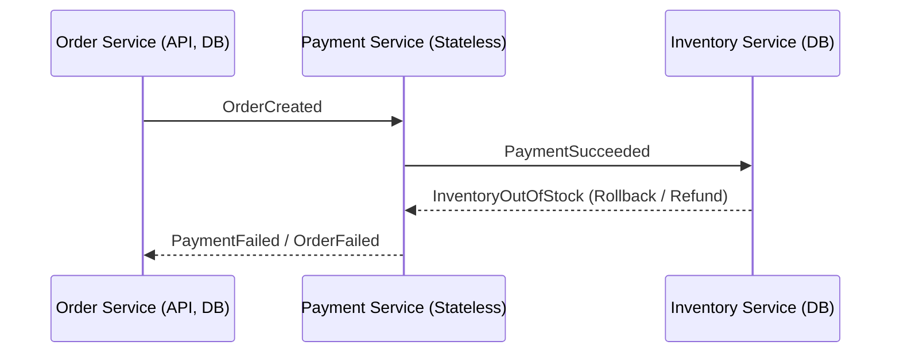

# Event-Driven E-commerce Platform with the Saga Pattern

This project is a demonstration of an event-driven microservices architecture for a simple e-commerce platform. It uses the **Saga pattern** to manage distributed transactions across multiple services, ensuring data consistency without the need for traditional two-phase commits.

The core of the project is a transaction for placing an order, which involves three services: an Order Service, a Payment Service, and an Inventory Service. The system is designed to be resilient, handling failures gracefully through compensating transactions.

---
## ## Architecture Diagram

The system follows a choreography-based saga, where services communicate by publishing and subscribing to events on Kafka topics without a central orchestrator.



---
## ## Tech Stack

* **Backend:** Node.js, TypeScript
* **Messaging:** Apache Kafka (managed via KafkaJS)
* **Database:** PostgreSQL
* **Containerization:** Docker, Docker Compose
* **Observability:** Correlation IDs for distributed tracing

---
## ## Getting Started

### Prerequisites

* Docker and Docker Compose are installed and running.
* Node.js (for local development, if not using Docker for services).

### Running the Application

1.  **Clone the repository:**
    ```sh
    git clone <your-repo-url>
    cd <repo-name>
    ```

2.  **Build and Run with Docker Compose:**
    This single command will build the Docker images for each service, start all infrastructure (Kafka, PostgreSQL), and run the entire application.
    ```sh
    docker-compose up --build
    ```
    The system is now running. The Order Service API is available at `http://localhost:3000`.

---
## ## Event Flow & Testing

### Success Scenario (Happy Path)

1.  A `POST` request is sent to `http://localhost:3000/orders`.
2.  **Order Service** creates an order in `PENDING` status and publishes an `OrderCreated` event.
3.  **Payment Service** consumes the event, processes the payment, and publishes `PaymentSucceeded`.
4.  **Inventory Service** consumes the event, reserves stock, and publishes `InventoryReserved`.
5.  **Order Service** consumes the final event and updates the order status to `CONFIRMED`.

### Failure Scenario (Inventory Rollback)

1.  Steps 1-3 are the same as above.
2.  **Inventory Service** finds that there is not enough stock and publishes `InventoryOutOfStock`.
3.  **Payment Service** consumes this event and triggers a **compensating transaction** (a refund).
4.  **Order Service** also consumes the event and updates the order status to `FAILED`.